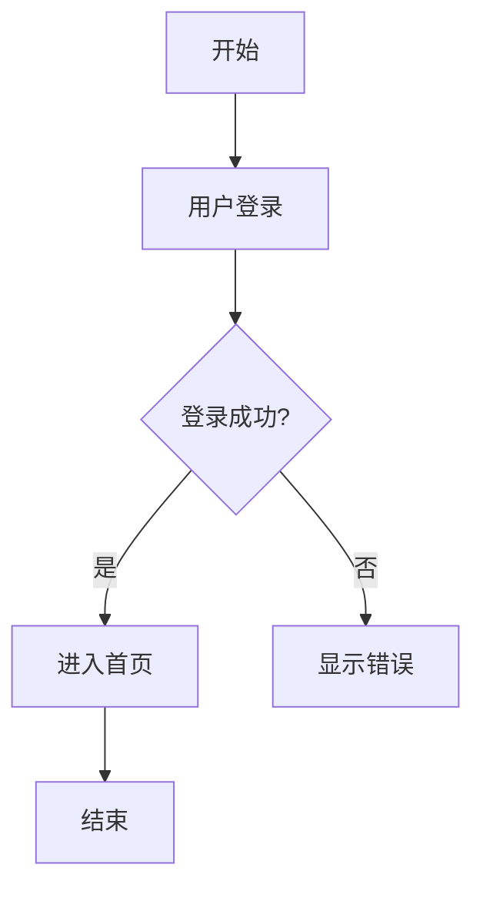

# PRD 需求文档创建器

## When to Run
- 用户说"创建需求文档"、"写PRD文档"
- 用户说"帮我写一个产品需求文档"
- 用户说"新建PRD"

## 文档模板结构

创建的需求文档包含以下章节：

```
# 需求文档：{需求名称}

## 1. 需求背景
{描述需求产生的背景和原因}

## 2. 产品目标
{描述产品要达成的目标}

## 3. 功能说明
{整体功能概述}

## 4. 流程图
{业务流程图，通过 HTML 生成并截图插入}

## 5. 功能详情
### 5.1 功能点一
- 功能描述
- 交互说明
- 原型图/截图

### 5.2 功能点二
...
```

---

## API 接口

### 1. 创建文档

**接口**: `POST /open-apis/docx/v1/documents`

```bash
curl -X POST "https://open.feishu.cn/open-apis/docx/v1/documents" \
  -H "Authorization: Bearer {tenant_access_token}" \
  -H "Content-Type: application/json" \
  -d '{
    "title": "需求文档：首页优化"
  }'
```

**返回**：
```json
{
  "code": 0,
  "data": {
    "document": {
      "document_id": "doxcnxxx",
      "title": "需求文档：首页优化"
    }
  }
}
```

### 2. 获取文档 Block 结构

**接口**: `GET /open-apis/docx/v1/documents/{document_id}/blocks/{block_id}`

### 3. 创建 Block（写入内容）

**接口**: `POST /open-apis/docx/v1/documents/{document_id}/blocks/{block_id}/children/batch_create`

```bash
curl -X POST "https://open.feishu.cn/open-apis/docx/v1/documents/{document_id}/blocks/{block_id}/children/batch_create" \
  -H "Authorization: Bearer {tenant_access_token}" \
  -H "Content-Type: application/json" \
  -d '{
    "children": [
      {
        "block_type": 2,
        "heading2": {
          "elements": [{"text_run": {"content": "1. 需求背景"}}]
        }
      },
      {
        "block_type": 2,
        "text": {
          "elements": [{"text_run": {"content": "这是需求背景的内容..."}}]
        }
      }
    ],
    "index": 0
  }'
```

### 4. 上传图片

**接口**: `POST /open-apis/im/v1/images`

```bash
curl -X POST "https://open.feishu.cn/open-apis/im/v1/images" \
  -H "Authorization: Bearer {tenant_access_token}" \
  -F "image_type=message" \
  -F "image=@/path/to/image.png"
```

**返回**：
```json
{
  "code": 0,
  "data": {
    "image_key": "img_v2_xxx"
  }
}
```

**注意**：返回的 `image_key` 即为 `multimedia_id`，用于插入文档。

### 5. 插入图片到文档

**接口**: `POST /open-apis/docx/v1/documents/{document_id}/blocks/{block_id}/children/batch_create`

```bash
curl -X POST "https://open.feishu.cn/open-apis/docx/v1/documents/{document_id}/blocks/{block_id}/children/batch_create" \
  -H "Authorization: Bearer {tenant_access_token}" \
  -H "Content-Type: application/json" \
  -d '{
    "children": [
      {
        "block_type": 27,
        "image": {
          "token": "img_v2_xxx",
          "width": 600,
          "height": 400
        }
      }
    ],
    "index": 0
  }'
```

---

## 流程图生成

### 方式一：HTML + 截图

1. **生成 HTML 流程图**

使用 HTML/CSS 生成流程图，示例：

```html
<!DOCTYPE html>
<html>
<head>
  <style>
    .flowchart { display: flex; flex-direction: column; align-items: center; font-family: Arial; }
    .box { padding: 15px 30px; border: 2px solid #333; border-radius: 8px; margin: 10px; background: #f5f5f5; }
    .arrow { font-size: 24px; color: #333; }
    .decision { background: #fff3cd; transform: rotate(0deg); }
    .start-end { background: #d4edda; border-radius: 25px; }
  </style>
</head>
<body>
  <div class="flowchart">
    <div class="box start-end">开始</div>
    <div class="arrow">↓</div>
    <div class="box">用户登录</div>
    <div class="arrow">↓</div>
    <div class="box decision">是否成功？</div>
    <div class="arrow">↓</div>
    <div class="box">进入首页</div>
    <div class="arrow">↓</div>
    <div class="box start-end">结束</div>
  </div>
</body>
</html>
```

2. **截图**

使用工具截图（如 puppeteer、playwright 或手动截图）：

```bash
# 使用 puppeteer 截图
npx puppeteer screenshot file:///path/to/flowchart.html output.png
```

3. **上传图片**

```bash
curl -X POST "https://open.feishu.cn/open-apis/im/v1/images" \
  -H "Authorization: Bearer {tenant_access_token}" \
  -F "image_type=message" \
  -F "image=@output.png"
```

### 方式二：Mermaid 语法

也可以使用 Mermaid 语法描述流程图，然后转换为图片：



---

## 创建文档流程

### Step 1: 收集需求信息

询问用户提供：
- **需求名称**（必填）
- **需求背景**（必填）
- **产品目标**（必填）
- **功能说明**（必填，可多个功能点）
- **是否需要流程图**（可选，默认需要）

### Step 2: 生成文档内容

根据用户输入，按模板结构组织内容。

### Step 3: 生成流程图（如需要）

1. 根据功能描述生成 HTML 流程图
2. 截图保存为临时文件
3. 调用飞书 API 上传图片，获取 `image_key`

### Step 4: 创建飞书文档

1. 调用创建文档 API
2. 依次写入各章节内容
3. 在"流程图"章节插入上传的图片

### Step 5: 返回文档链接

```
━━━━━━━━━━━━━━━━━━━━━━━━━━━━
📄 PRD文档已创建

📌 文档名称：需求文档：首页优化
🔗 文档链接：https://ewbmxoqgfx.feishu.cn/docx/doxcnxxx

📑 文档结构：
  1. 需求背景
  2. 产品目标
  3. 功能说明
  4. 流程图（含图片）
  5. 功能详情
     - 5.1 用户登录
     - 5.2 首页展示
━━━━━━━━━━━━━━━━━━━━━━━━━━━━
```

---

## 示例对话

**用户**: 帮我创建一个需求文档

**Agent**: 请提供需求信息：

1. **需求名称**：这是什么需求？
2. **需求背景**：为什么需要这个功能？
3. **产品目标**：要达成什么目标？
4. **功能说明**：有哪些功能点？

**用户**:
- 需求名称：用户注册优化
- 需求背景：当前注册流程繁琐，转化率低
- 产品目标：提升注册转化率至 30%
- 功能说明：简化注册流程、增加第三方登录、优化错误提示

**Agent**:
```
📝 请确认需求文档信息：

- 需求名称：用户注册优化
- 需求背景：当前注册流程繁琐，转化率低
- 产品目标：提升注册转化率至 30%
- 功能说明：
  1. 简化注册流程
  2. 增加第三方登录
  3. 优化错误提示
- 是否生成流程图：是

确认创建？(是/否)
```

**用户**: 确认

**Agent**:
```
⏳ 正在创建文档...
⏳ 正在生成流程图...
⏳ 正在上传图片...
⏳ 正在写入内容...

━━━━━━━━━━━━━━━━━━━━━━━━━━━━
📄 PRD文档已创建

📌 文档名称：需求文档：用户注册优化
🔗 文档链接：https://ewbmxoqgfx.feishu.cn/docx/doxcnxxx

📑 文档结构：
  1. 需求背景
  2. 产品目标
  3. 功能说明
  4. 流程图（含图片）
  5. 功能详情
     - 5.1 简化注册流程
     - 5.2 增加第三方登录
     - 5.3 优化错误提示
━━━━━━━━━━━━━━━━━━━━━━━━━━━━
```

---

## Block 类型参考

| block_type | 说明 |
|------------|------|
| 1 | 页面 |
| 2 | 标题（Heading） |
| 3 | 正文（Text） |
| 4 | 无序列表 |
| 5 | 有序列表 |
| 6 | 代码块 |
| 8 | 引用 |
| 12 | 分割线 |
| 27 | 图片 |
| 28 | 表格 |

---

## 注意事项

1. **图片上传限制**：
   - 支持格式：png, jpg, jpeg, gif
   - 最大大小：20MB

2. **文档权限**：
   - 默认创建的文档仅自己可见
   - 需要额外调用权限 API 开放访问

3. **流程图生成**：
   - 确保 HTML 渲染正确后再截图
   - 图片宽度建议 600-800px